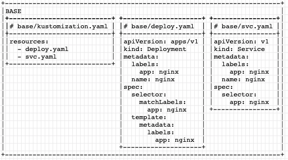

# Kustomize illustrated

Its much easier to understand how [kustomize](https://github.com/kubernetes-sigs/kustomize) works if you see some pictures ...

## Base

The gist of kustomize is the process:
- just put plane old yaml files (deployment/svc) into a directory
- add an extra `kustomization.yaml` file:



Done, that was it, now you know kustomize ...

Now you can use `kubectl apply` but instead of `-f` use `-k`:
```
kubectl apply -k base
```

## Pros/QA separated namespaces

