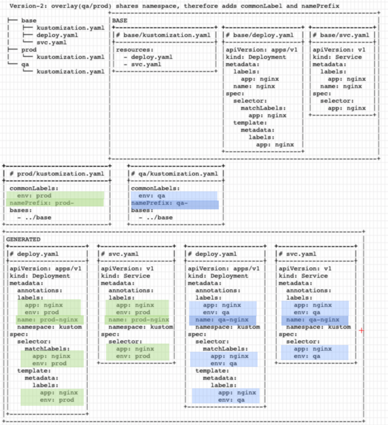

# Kustomize illustrated

Its much easier to understand how [kustomize](https://github.com/kubernetes-sigs/kustomize) works if you see some pictures ...

## Base

The gist of kustomize is in the structure:
- just put plane old yaml files (deployment/svc) into a directory
- add an extra `kustomization.yaml` file:


Done, that was it, now you know kustomize ... (hint: there is more)

You can use `kubectl apply` but instead of `-f` use `-k`:
```
kubectl apply -k base
```

## Prod/QA separated namespaces

Now imagine you want to use the same 2 resources for qa and prod.
Easy, you create 2 new directories, each with its own kustomization.yaml:

```
├── base
│   ├── kustomization.yaml
│   ├── deploy.yaml
│   └── svc.yaml
├── prod
│   └── kustomization.yaml
└── qa
    └── kustomization.yaml
```

Both new kustomization.yaml will reference to the `base` directory, and to avoid any
collision, they define they own namespace:


The easiest way is just to simply add a `namespace` property to 

## Shared namespace

Now in a different scenario: you want to use the same resources (depl/svc) but in the **same namespace**.
Something like blue/green versions.

First trick is to use the `namePrefix:` in kustomization.yaml. This way you will create these resources:
```
$ kubectl apply -k prod
service/prod-nginx created
deployment.apps/prod-nginx created

$ kubectl apply -k qa
service/qa-nginx created 
deployment.apps/qa-nginx created
```

But now all all pods share the same labels, so the 2 services: `service/prod-nginx` and `service/qa-nginx`
will point to the same set of pods (one production pod and one qa)

The solution is to use `commonLabels:`

